 
# Natural Semantics in Haskell for __While__ language

The __While__ language is specified at H. R. Nielson and F. Nielson, Semantics with applications: an appetizer. London: Springer, 2007.

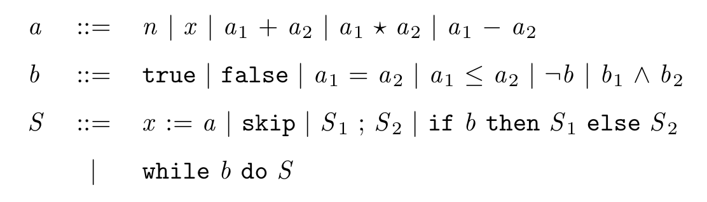
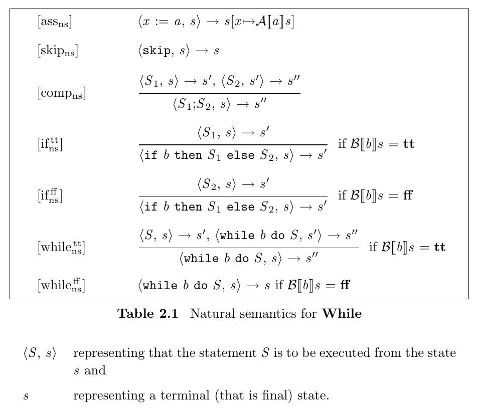

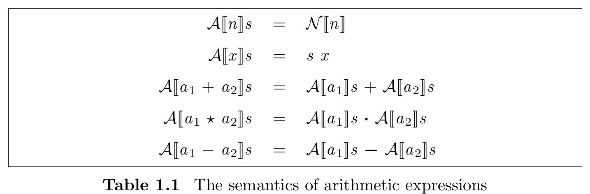

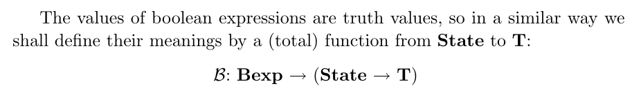
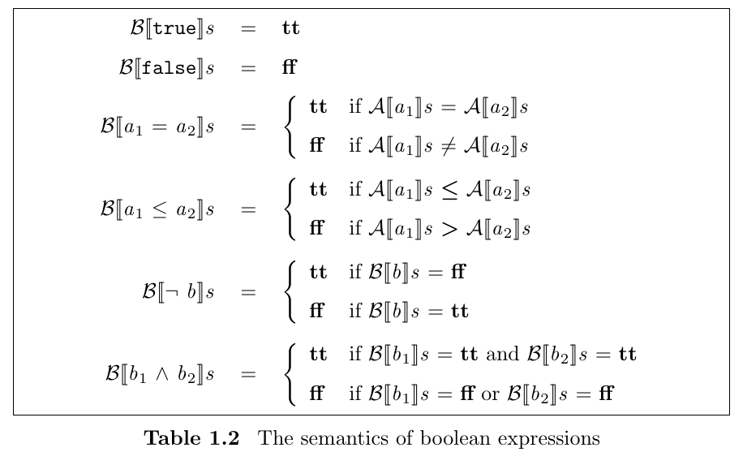
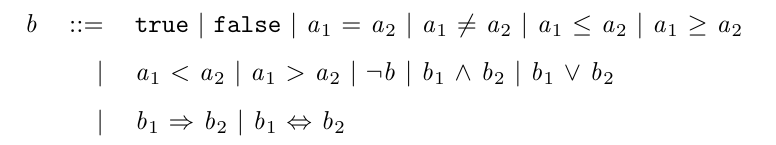

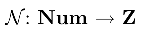
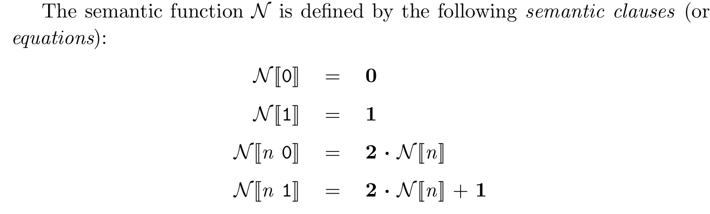
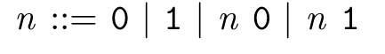

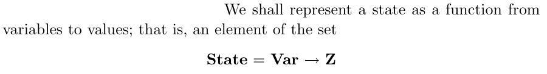

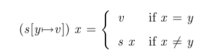
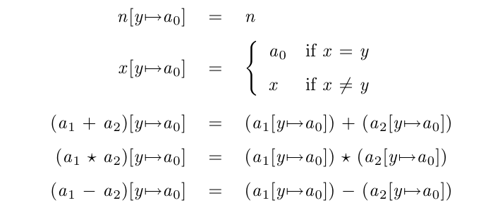
